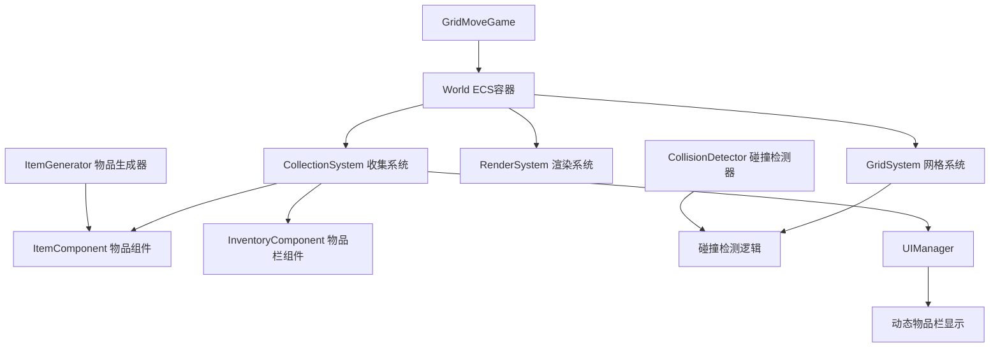

## 用户需求

用户要求对GridMove游戏的物品栏系统进行全面优化，实现基于ECS架构的物品收集系统。

## 核心功能

### 物品栏清理

- 移除UIManager中现有的硬编码物品（剑、盾、药水等）
- 清空当前物品栏，为新的收集系统做准备

### 金币收集系统

- 金币作为可收集物品显示在网格中，不影响地形属性
- 角色到达格子中心时触发碰撞检测，金币消失
- 物品栏中金币数量实时更新显示

### 种子收集系统

- 与金币系统逻辑一致，仅表现形式和物品ID不同
- 支持独立的收集计数和显示

### 未来扩展规划

- 阻挡型物品：如大石头，会阻挡角色移动
- 地形属性型物品：如土块，属于网格属性，挖掘后变成物品

## 技术要求

- 基于现有ECS架构实现
- 与地形系统和移动系统无缝集成
- 碰撞检测：角色必须到达格子中心才算碰撞
- 保持微信小游戏环境兼容性

## 技术栈选择

基于现有项目的技术栈：

- **开发语言**: JavaScript (ES6+)
- **架构模式**: ECS (Entity-Component-System)
- **渲染引擎**: Canvas 2D
- **运行环境**: 微信小游戏
- **项目结构**: 模块化ES6导入/导出

## 实现方案

### 核心设计思路

采用ECS架构扩展现有系统，新增物品收集功能。通过创建ItemComponent组件和CollectionSystem系统，实现物品的生成、渲染、碰撞检测和收集逻辑。利用现有的GridSystem中的格子中心检测机制（distance < 3像素），确保碰撞检测的准确性。

### 关键技术决策

1. **组件设计**: 创建ItemComponent存储物品类型、位置、状态等信息
2. **系统集成**: CollectionSystem与现有GridSystem协同工作，复用格子中心检测逻辑
3. **UI更新**: 重构UIManager的物品栏部分，从硬编码改为动态数据驱动
4. **性能优化**: 物品实体按需创建和销毁，避免内存泄漏

### 架构设计

#### 系统架构图



#### 数据流设计

1. **物品生成**: ItemGenerator → ItemComponent → 渲染到网格
2. **碰撞检测**: GridSystem格子中心检测 → CollectionSystem处理收集
3. **UI更新**: InventoryComponent数据变化 → UIManager动态渲染

### 实现细节

#### 性能优化策略

- **空间分区**: 使用网格坐标快速定位物品，避免全局遍历
- **对象池**: 复用物品实体，减少频繁创建销毁的开销
- **批量更新**: UI更新采用脏标记机制，只在数据变化时重新渲染

#### 碰撞检测机制

复用GridSystem现有的格子中心检测逻辑（distance < 3像素），确保与角色移动系统的一致性。当角色到达格子中心时，CollectionSystem检查该位置是否有可收集物品。

#### 错误处理与容错

- 物品生成时检查网格位置有效性
- 收集时验证物品状态，防止重复收集
- UI更新异常时提供降级显示方案

## 目录结构

### 新增文件结构

```
game/games/GridMove/
├── components/
│   ├── ItemComponent.js          # [NEW] 物品组件 - 定义物品的基本属性（类型、位置、状态、渲染信息）
│   └── InventoryComponent.js     # [NEW] 物品栏组件 - 管理玩家的物品收集数据（金币数量、种子数量等）
├── systems/
│   └── CollectionSystem.js       # [NEW] 收集系统 - 处理物品收集逻辑，包括碰撞检测、物品拾取、物品栏更新
├── utils/
│   └── ItemGenerator.js          # [NEW] 物品生成器 - 负责在地图上随机生成各类物品，管理物品的创建和配置
└── ui/
    └── UIManager.js               # [MODIFY] UI管理器 - 重构物品栏显示逻辑，从硬编码改为动态数据驱动显示
```

### 修改文件说明

- **GridMoveGame.js**: 注册新的CollectionSystem，初始化物品生成器
- **UIManager.js**: 重构物品栏渲染逻辑，支持动态物品数据显示

## 关键代码结构

### ItemComponent接口定义

```javascript
// 物品组件接口
class ItemComponent {
  constructor(type, gridX, gridY, config = {}) {
    this.type = type;           // 物品类型：'coin', 'seed', 'block', 'terrain'
    this.gridX = gridX;         // 网格X坐标
    this.gridY = gridY;         // 网格Y坐标
    this.collected = false;     // 是否已被收集
    this.config = config;       // 物品配置（颜色、大小等）
  }
}
```

### InventoryComponent接口定义

```javascript
// 物品栏组件接口
class InventoryComponent {
  constructor() {
    this.items = new Map();     // 物品类型 -> 数量的映射
  }
  
  addItem(type, count = 1);     // 添加物品
  getItemCount(type);           // 获取物品数量
  hasItem(type, count = 1);     // 检查是否拥有足够物品
}
```

### CollectionSystem核心接口

```javascript
// 收集系统接口
class CollectionSystem extends System {
  constructor(gridSize, cellSize);
  
  update(deltaTime, entities);           // 主更新循环
  checkCollision(playerEntity, items);   // 碰撞检测
  collectItem(playerEntity, itemEntity); // 收集物品
}
```

## 代理扩展

### SubAgent

- **code-explorer**
- 目的：深入探索现有ECS架构的实现细节，确保新系统与现有组件和系统的兼容性
- 预期结果：获得详细的组件接口规范、系统交互模式，为物品收集系统的设计提供准确的技术基础