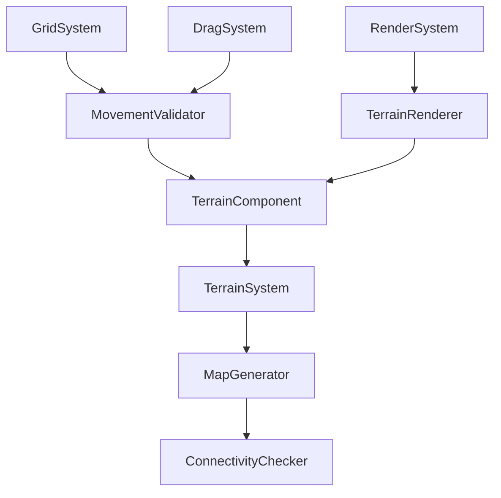

## 用户需求

优化现有网格移动游戏的地图系统，实现地形差异化和随机地图生成功能。

## 产品概述

在现有30x30网格系统基础上，增加地形类型区分，实现可行走和不可行走区域，并提供智能的随机地图生成算法。

## 核心功能

- **地形类型系统**：实现水格子（不可行走）和土格子（可行走）两种基础地形类型
- **移动限制**：玩家只能在土格子上移动，水格子阻挡移动
- **随机地图生成**：以地图中心为起点，向外扩展形成圆形主体陆地区域
- **边缘水域控制**：地图外围2-5格范围内合理分布水格子
- **连通性保证**：确保所有土地区域相互连通，避免孤岛出现
- **视觉差异化**：不同地形类型具有明显的视觉区别

## 技术栈选择

基于现有项目技术栈：

- **核心框架**：JavaScript + ECS架构（Entity-Component-System）
- **渲染系统**：Canvas 2D API
- **项目结构**：微信小游戏框架

## 实现方案

### 核心技术决策

采用**组件化地形系统**设计，通过新增TerrainComponent来管理地形数据，结合现有GridSystem实现移动限制。选择**程序化生成算法**实现随机地图，使用**Flood Fill连通性检测**确保地图质量。

### 架构设计



### 实现细节

#### 性能优化

- **地形数据结构**：使用二维数组存储地形类型，O(1)查询复杂度
- **连通性检测**：采用BFS算法，时间复杂度O(n²)，仅在地图生成时执行
- **渲染优化**：地形背景预渲染到离屏Canvas，避免每帧重绘

#### 可靠性保障

- **预判断移动**：在DragSystem中，根据当前格子和移动方向计算目标格子，提前检查可行走性
- **即时反馈**：拖拽到不可行走区域时立即给出视觉反馈，避免无效移动
- **生成重试机制**：连通性检测失败时自动重新生成，最多重试5次
- **边界处理**：严格控制地图边界，防止越界访问
- **属性驱动**：通过地形配置的walkable属性统一控制移动逻辑，便于扩展

#### 扩展性设计

- **地形类型枚举**：便于后续添加新地形类型（如山地、沙漠、森林等）
- **属性驱动架构**：每种地形类型都有walkable属性，新地形只需配置此属性即可
- **配置驱动**：地图生成参数可通过gameConfig.json配置
- **组件解耦**：地形逻辑独立，不影响现有移动和渲染系统
- **预判断机制**：移动检查基于网格坐标计算，性能优异且易于扩展

## 目录结构

### 新增文件

```
game/games/GridMove/
├── components/
│   └── TerrainComponent.js     # [NEW] 地形组件，存储每个格子的地形类型（水/土），提供地形查询和设置接口
├── systems/
│   └── TerrainSystem.js        # [NEW] 地形系统，负责地形渲染、移动验证和地形交互逻辑
└── utils/
    ├── MapGenerator.js          # [NEW] 地图生成器，实现随机地图生成算法，包含圆形扩展和边缘处理逻辑
    └── TerrainTypes.js          # [NEW] 地形类型定义，包含WATER和LAND常量及相关配置
```

### 修改文件

```
game/games/GridMove/
├── GridMoveGame.js              # [MODIFY] 集成地形系统，初始化地图生成器，添加地形相关配置
├── systems/
│   ├── GridSystem.js            # [MODIFY] 移除像素级移动检查，改为基于网格坐标的预判断
│   └── DragSystem.js            # [MODIFY] 在拖拽开始时预检查目标格子可行走性，提供即时反馈
└── config/
    └── gameConfig.json          # [MODIFY] 添加地形生成参数配置（陆地比例、边缘水域范围等）
```

## 关键代码结构

### 地形类型定义

```javascript
// TerrainTypes.js
export const TERRAIN_TYPES = {
  WATER: 0,  // 水格子
  LAND: 1    // 土格子
  // 未来可扩展: MOUNTAIN: 2, DESERT: 3, FOREST: 4 等
};

export const TERRAIN_CONFIG = {
  [TERRAIN_TYPES.WATER]: { 
    color: '#4A90E2', 
    walkable: false,  // 核心属性：是否可行走
    name: '水域'
  },
  [TERRAIN_TYPES.LAND]: { 
    color: '#8B7355', 
    walkable: true,   // 核心属性：是否可行走
    name: '陆地'
  }
  // 未来扩展示例:
  // [TERRAIN_TYPES.MOUNTAIN]: { color: '#8B4513', walkable: false, name: '山地' }
};
```

### 地形组件接口

```javascript
// TerrainComponent.js
export class TerrainComponent extends Component {
  constructor(gridSize);
  getTerrainAt(gridX, gridY);           // 获取指定位置的地形类型
  setTerrainAt(gridX, gridY, terrainType); // 设置指定位置的地形类型
  isWalkable(gridX, gridY);             // 核心方法：检查指定位置是否可行走
  getTerrainConfig(terrainType);        // 获取地形类型的完整配置信息
  canMoveTo(fromGridX, fromGridY, toGridX, toGridY); // 预判断移动是否可行
}
```

### 地图生成器接口

```javascript
// MapGenerator.js
export class MapGenerator {
  constructor(gridSize, config);
  generateMap();
  isConnected(terrainMap);
  expandFromCenter(terrainMap, landRatio);
}
```

## 智能代码探索

### SubAgent

- **code-explorer**
- 目的：深度分析现有ECS系统架构，确保新增地形系统与现有组件和系统完美集成
- 预期结果：获得详细的组件依赖关系和系统交互模式，指导地形系统的设计和实现