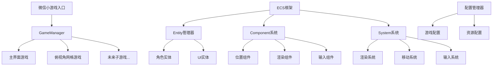

## 用户需求

基于微信小游戏平台，构建一个支持多子游戏切换的游戏框架系统

## 产品概述

一个微信小游戏平台，包含游戏选择界面和多个子游戏。主界面显示"太阳鸟游戏"标题，提供翻页浏览不同子游戏的功能。首个子游戏是俯视角网格移动游戏，玩家通过拖拽控制角色在40x40网格中连续移动。

## 核心功能

- ECS架构框架：实现Entity-Component-System游戏架构
- GameManager游戏管理器：处理子游戏间切换，管理生命周期（init、loop、release）
- 主界面：居中标题"太阳鸟游戏"，翻页式子游戏选择按钮
- 俯视角网格游戏：40x40网格，拖拽控制角色连续移动并停在网格点
- 配置系统：游戏参数配置文件管理
- 完整文档：技术架构和使用说明文档

## 技术栈选择

- **平台**: 微信小游戏
- **开发语言**: JavaScript (ES6+)
- **渲染**: Canvas 2D API
- **架构模式**: ECS (Entity-Component-System)
- **输入处理**: 微信小游戏触摸事件API
- **资源管理**: 微信小游戏资源加载API
- **配置管理**: JSON配置文件

## 实现方案

采用模块化ECS架构设计，通过GameManager统一管理多个子游戏的生命周期。主界面使用Canvas渲染UI组件，子游戏通过ECS系统实现游戏逻辑。触摸控制系统处理拖拽输入，网格系统管理角色移动和定位。

**关键技术决策**:

- ECS架构提供良好的扩展性，便于添加新的游戏功能和组件
- GameManager采用状态机模式管理游戏切换
- Canvas分层渲染优化性能，UI层和游戏层分离
- 配置文件集中管理游戏参数，便于调整和扩展

## 实现细节

**性能优化**:

- Canvas双缓冲渲染减少闪烁
- 对象池复用减少GC压力
- 网格碰撞检测优化算法复杂度为O(1)

**架构设计**:

- ECS系统松耦合设计，组件可复用
- 事件系统处理游戏内通信
- 资源管理器统一处理图片、音频加载

## 架构设计

### 系统架构图



### 模块划分

- **核心框架模块**: ECS架构实现，提供Entity、Component、System基础类
- **游戏管理模块**: GameManager处理游戏状态切换和生命周期
- **渲染模块**: Canvas渲染系统，支持分层和优化
- **输入模块**: 触摸事件处理和手势识别
- **配置模块**: JSON配置文件读取和管理
- **子游戏模块**: 各个具体游戏的实现

## 目录结构

### 目录结构概述

这是一个从零开始的微信小游戏项目，需要创建完整的项目结构。包含ECS框架核心、游戏管理器、子游戏实现和配置系统。

```
game/
├── game.js                    # [NEW] 微信小游戏入口文件，初始化GameManager并启动游戏主循环
├── game.json                  # [NEW] 微信小游戏配置文件，定义游戏基本信息和权限设置
├── project.config.json        # [NEW] 微信开发者工具项目配置文件
├── core/
│   ├── ecs/
│   │   ├── Entity.js          # [NEW] 实体类，管理组件的添加、删除和获取，提供唯一ID生成
│   │   ├── Component.js       # [NEW] 组件基类，定义组件接口和生命周期方法
│   │   ├── System.js          # [NEW] 系统基类，处理具有特定组件的实体，实现游戏逻辑更新
│   │   └── World.js           # [NEW] ECS世界管理器，统一管理所有实体、组件和系统的注册与更新
│   ├── components/            # [NEW] 核心通用组件，保持最简单最通用的抽象
│   │   ├── PositionComponent.js   # [NEW] 位置组件，存储基础的x、y坐标信息
│   │   ├── RenderComponent.js     # [NEW] 渲染组件，定义最基础的渲染属性（颜色、大小等）
│   │   ├── InputComponent.js      # [NEW] 输入组件，标记实体可接收输入事件的基础接口
│   │   └── MovementComponent.js   # [NEW] 移动组件，存储基础的移动速度和目标位置
│   ├── systems/               # [NEW] 核心通用系统，提供最基础的功能实现
│   │   ├── RenderSystem.js        # [NEW] 基础渲染系统，提供通用的Canvas绘制功能
│   │   ├── MovementSystem.js      # [NEW] 基础移动系统，处理通用的位置更新逻辑
│   │   └── InputSystem.js         # [NEW] 基础输入系统，处理通用的触摸事件分发
│   ├── GameManager.js         # [NEW] 游戏管理器，处理子游戏切换、生命周期管理和静态方法接口
│   ├── Renderer.js            # [NEW] 渲染管理器，封装Canvas操作，提供分层渲染和基础绘图方法
│   ├── InputManager.js        # [NEW] 输入管理器，处理触摸事件、手势识别和输入状态管理
│   └── ConfigManager.js       # [NEW] 配置管理器，加载和管理JSON配置文件，提供配置访问接口
├── games/
│   ├── MainMenu/              # [NEW] 主菜单游戏文件夹
│   │   ├── MainMenuGame.js    # [NEW] 主菜单游戏主类，实现"太阳鸟游戏"界面和子游戏选择
│   │   ├── components/        # [NEW] 主菜单专用组件
│   │   │   ├── ButtonComponent.js    # [NEW] 按钮组件，处理游戏选择按钮
│   │   │   └── UIComponent.js        # [NEW] UI组件，处理标题和界面元素
│   │   ├── systems/           # [NEW] 主菜单专用系统
│   │   │   ├── UISystem.js           # [NEW] UI系统，处理界面渲染和交互
│   │   │   └── NavigationSystem.js  # [NEW] 导航系统，处理翻页和游戏切换
│   └── GridMove/              # [NEW] 俯视角网格游戏文件夹
│       ├── GridMoveGame.js    # [NEW] 网格游戏主类，实现40x40网格和角色控制
│       ├── components/        # [NEW] 网格游戏专用组件
│       │   ├── GridComponent.js      # [NEW] 网格组件，管理网格状态和位置
│       │   └── PlayerComponent.js    # [NEW] 玩家组件，存储玩家特有属性
│       └── systems/           # [NEW] 网格游戏专用系统
│           ├── GridSystem.js         # [NEW] 网格系统，处理网格逻辑和碰撞
│           └── DragSystem.js         # [NEW] 拖拽系统，处理触摸拖拽控制
├── config/
│   ├── gameConfig.json        # [NEW] 游戏配置文件，包含网格大小、移动速度、屏幕尺寸等参数
│   └── resourceConfig.json    # [NEW] 资源配置文件，定义图片、音频等资源路径和加载信息
├── assets/
│   ├── images/
│   │   ├── common/            # [NEW] 通用图片资源（框架UI、按钮等）
│   │   ├── MainMenu/          # [NEW] 主菜单游戏图片资源
│   │   │   ├── title-logo.png        # [NEW] "太阳鸟游戏"标题图片
│   │   │   ├── game-buttons/          # [NEW] 游戏选择按钮图片
│   │   │   └── ui-elements/           # [NEW] 主菜单UI元素图片
│   │   └── GridMove/          # [NEW] 网格游戏图片资源
│   │       ├── player.png            # [NEW] 玩家角色图片
│   │       ├── grid-bg.png           # [NEW] 网格背景图片
│   │       └── preview.png           # [NEW] 游戏预览图片
│   └── audio/                 # [NEW] 音频资源文件夹
│       ├── common/            # [NEW] 通用音效（点击、切换等）
│       ├── MainMenu/          # [NEW] 主菜单音效
│       └── GridMove/          # [NEW] 网格游戏音效
└── docs/
    ├── README.md              # [NEW] 项目说明文档，介绍项目结构、运行方法和开发指南
    ├── ECS架构说明.md         # [NEW] ECS架构详细说明，包含概念解释和使用示例
    └── API文档.md             # [NEW] 核心API文档，说明各个类和方法的使用方式
```

## 智能助手扩展

### SubAgent

- **code-explorer**
- 用途：探索和分析微信小游戏项目结构，确保架构设计符合最佳实践
- 预期结果：提供详细的代码结构分析和优化建议，确保ECS框架设计合理

### Skill  

- **skill-creator**
- 用途：创建微信小游戏开发技能，为后续类似项目提供可复用的开发模板
- 预期结果：生成包含ECS架构、游戏管理和Canvas渲染的专业技能模板