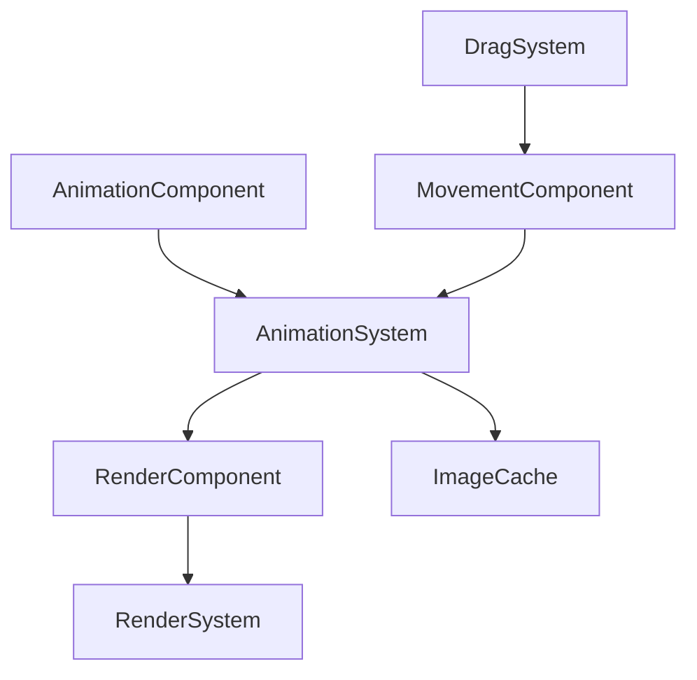

## 用户需求

为网格移动游戏中的角色添加动画系统，包括：

- 生成角色的走路和站立动画图片
- 实现相应的动画播放系统
- 走路动画控制在5帧以内，站立动画3帧（简单呼吸效果）

## 产品概述

当前项目是基于ECS架构的微信小游戏，角色目前使用绿色圆形渲染。需要将其替换为精美的动画角色，提升游戏的视觉体验和沉浸感。

## 核心功能

- **动画资源生成**：创建角色走路（4帧）和站立（3帧）的动画帧图片
- **动画组件系统**：基于ECS架构实现AnimationComponent来管理动画状态
- **动画播放系统**：实现AnimationSystem来处理帧切换和动画循环
- **状态驱动动画**：根据角色移动状态自动切换走路和站立动画
- **方向感知动画**：支持四个方向（上下左右）的动画播放

## 技术栈选择

基于现有项目架构：

- **游戏引擎**：自研ECS架构（Entity-Component-System）
- **渲染系统**：Canvas 2D API + 自定义Renderer类
- **资源管理**：微信小游戏原生图片加载
- **动画实现**：基于帧序列的2D精灵动画

## 实现方案

### 核心技术决策

采用**基于帧序列的精灵动画系统**，通过定时切换图片帧来实现动画效果。这种方案具有以下优势：

- 与现有RenderSystem完美集成，无需大幅修改架构
- 性能优异，适合微信小游戏环境
- 易于扩展，支持多种动画状态和方向

### 实现细节

#### 动画资源策略

- **角色尺寸**：48x48像素（适配当前cellSize=50的网格）
- **走路动画**：4帧循环，帧率8FPS（125ms/帧）
- **站立动画**：3帧循环，帧率4FPS（250ms/帧），实现呼吸效果
- **方向支持**：上下左右四个方向，每个方向独立的动画序列

#### 性能优化

- **图片预加载**：游戏初始化时预加载所有动画帧，避免运行时加载延迟
- **内存管理**：使用Image对象缓存，避免重复创建
- **渲染优化**：复用现有RenderSystem的image渲染路径，无额外性能开销

#### 架构设计



## 架构设计

### 组件设计

- **AnimationComponent**：存储动画状态、当前帧、播放速度等
- **RenderComponent扩展**：利用现有image渲染能力，无需修改

### 系统设计  

- **AnimationSystem**：处理动画逻辑，更新RenderComponent的image属性
- **现有系统集成**：与MovementSystem和DragSystem协作，实现状态驱动的动画切换

### 数据流设计

1. DragSystem检测移动方向 → 更新MovementComponent状态
2. AnimationSystem读取MovementComponent状态 → 选择对应动画
3. AnimationSystem更新动画帧 → 设置RenderComponent.image
4. RenderSystem渲染图片 → 显示动画帧

## 目录结构

### 资源文件组织

```
game/assets/images/GridMove/character/
├── idle/                    # [NEW] 站立动画帧
│   ├── idle_down_1.png     # 向下站立第1帧
│   ├── idle_down_2.png     # 向下站立第2帧  
│   ├── idle_down_3.png     # 向下站立第3帧
│   ├── idle_up_1.png       # 向上站立动画帧
│   ├── idle_left_1.png     # 向左站立动画帧
│   └── idle_right_1.png    # 向右站立动画帧
└── walk/                    # [NEW] 走路动画帧
    ├── walk_down_1.png     # 向下走路第1帧
    ├── walk_down_2.png     # 向下走路第2帧
    ├── walk_down_3.png     # 向下走路第3帧
    ├── walk_down_4.png     # 向下走路第4帧
    ├── walk_up_1.png       # 向上走路动画帧
    ├── walk_left_1.png     # 向左走路动画帧
    └── walk_right_1.png    # 向右走路动画帧
```

### 代码文件组织

```
game/core/components/
└── AnimationComponent.js   # [NEW] 动画组件，管理动画状态、当前帧索引、播放速度、动画类型等。支持设置动画序列、控制播放/暂停、帧率调整等功能。

game/core/systems/
└── AnimationSystem.js      # [NEW] 动画系统，负责动画逻辑处理。根据时间更新动画帧，处理动画循环，根据MovementComponent状态切换动画类型，更新RenderComponent的image属性。

game/core/utils/
└── ImageLoader.js          # [NEW] 图片加载工具类，提供异步图片加载、批量预加载、图片缓存管理功能。封装微信小游戏的图片加载API，处理加载失败重试机制。

game/games/GridMove/GridMoveGame.js  # [MODIFY] 修改_createPlayer方法，添加AnimationComponent和AnimationSystem注册，集成图片预加载逻辑。
```

## 关键代码结构

### AnimationComponent接口

```typescript
class AnimationComponent {
  constructor(animations: AnimationConfig)
  setAnimation(name: string, direction: string): void
  getCurrentFrame(): Image
  update(deltaTime: number): void
}

interface AnimationConfig {
  [animationName: string]: {
    [direction: string]: {
      frames: string[]
      frameRate: number
      loop: boolean
    }
  }
}
```

### AnimationSystem核心逻辑

```typescript
class AnimationSystem {
  update(deltaTime: number, entities: Entity[]): void
  private _updateAnimationState(entity: Entity): void
  private _selectAnimation(movementComp: MovementComponent): {name: string, direction: string}
}
```

## 智能体扩展

### SubAgent

- **code-explorer**
- 目的：深入探索现有ECS架构的实现细节，确保动画系统与现有组件和系统的完美集成
- 预期结果：获得详细的组件接口规范、系统交互模式和最佳实践，确保新增动画功能不破坏现有架构